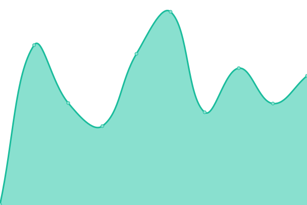
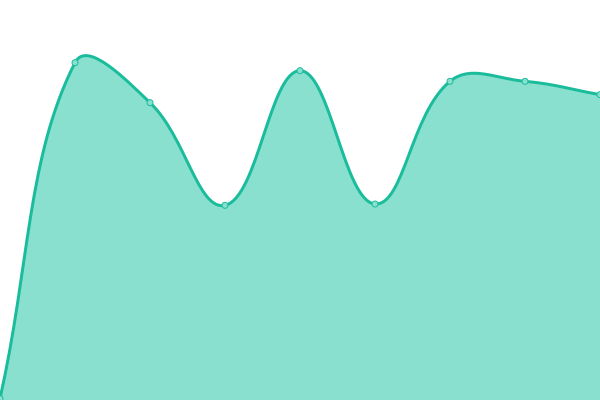
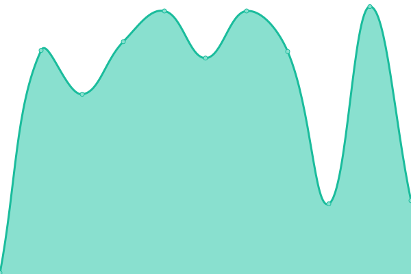

# [📈 Live Status](https://http://status.hachiroku.cn/): <!--live status--> **🟧 Partial outage**

This repository contains the open-source uptime monitor and status page for [Upptime](https://upptime.js.org), powered by [Upptime](https://github.com/upptime/upptime).

With [Upptime](https://upptime.js.org), you can get your own unlimited and free uptime monitor and status page, powered entirely by a GitHub repository. We use [Issues](https://github.com/upptime/upptime/issues) as incident reports, [Actions](https://github.com/ChesterHachirokuJamie/stats/actions) as uptime monitors, and [Pages](https://status.hachiroku.cn) for the status page.

<!--start: status pages-->
<!-- This summary is generated by Upptime (https://github.com/upptime/upptime) -->
<!-- Do not edit this manually, your changes will be overwritten -->
<!-- prettier-ignore -->
| URL | Status | History | Response Time | Uptime |
| --- | ------ | ------- | ------------- | ------ |
|  [Main Server (Server 02)](chesterjamie.cn) | 🟥 Down | [main-server-server-02.yml](https://github.com/ChesterHachirokuJamie/stats/commits/HEAD/history/main-server-server-02.yml) | 

 347ms
     
 | 

<a href="https://status.hachiroku.cn/history/main-server-server-02">90.43%</a>
    

|  [Chester Hachiroku Jamie Cloud Drive](chesterjamie.cn) | 🟥 Down | [chester-hachiroku-jamie-cloud-drive.yml](https://github.com/ChesterHachirokuJamie/stats/commits/HEAD/history/chester-hachiroku-jamie-cloud-drive.yml) | 

 298ms
     
 | 

<a href="https://status.hachiroku.cn/history/chester-hachiroku-jamie-cloud-drive">90.44%</a>
    

|  [Dufs-01](chesterjamie.cn) | 🟥 Down | [dufs-01.yml](https://github.com/ChesterHachirokuJamie/stats/commits/HEAD/history/dufs-01.yml) | 

 283ms
     
 | 

<a href="https://status.hachiroku.cn/history/dufs-01">90.45%</a>
    

|  [Syncthing Endpoint](chesterjamie.cn) | 🟥 Down | [syncthing-endpoint.yml](https://github.com/ChesterHachirokuJamie/stats/commits/HEAD/history/syncthing-endpoint.yml) | 

 239ms
     
 | 

<a href="https://status.hachiroku.cn/history/syncthing-endpoint">90.45%</a>
    

|  [Tomcat Web Service](chesterjamie.cn) | 🟩 Up | [tomcat-web-service.yml](https://github.com/ChesterHachirokuJamie/stats/commits/HEAD/history/tomcat-web-service.yml) | 

 206ms
     
 | 

<a href="https://status.hachiroku.cn/history/tomcat-web-service">90.46%</a>
    

|  [Matrix Synapse](chesterjamie.cn) | 🟩 Up | [matrix-synapse.yml](https://github.com/ChesterHachirokuJamie/stats/commits/HEAD/history/matrix-synapse.yml) | 

 246ms
     
 | 

<a href="https://status.hachiroku.cn/history/matrix-synapse">90.60%</a>
    

|  [Live Stream Server](chesterjamie.cn) | 🟥 Down | [live-stream-server.yml](https://github.com/ChesterHachirokuJamie/stats/commits/HEAD/history/live-stream-server.yml) | 

 229ms
     
 | 

<a href="https://status.hachiroku.cn/history/live-stream-server">90.45%</a>
    

|  [Main Server Performance Panel](chesterjamie.cn) | 🟥 Down | [main-server-performance-panel.yml](https://github.com/ChesterHachirokuJamie/stats/commits/HEAD/history/main-server-performance-panel.yml) | 

 211ms
     
 | 

<a href="https://status.hachiroku.cn/history/main-server-performance-panel">90.45%</a>
    

|  [Syncthing Relay Service Metrics](chesterjamie.cn) | 🟥 Down | [syncthing-relay-service-metrics.yml](https://github.com/ChesterHachirokuJamie/stats/commits/HEAD/history/syncthing-relay-service-metrics.yml) | 

 188ms
     
 | 

<a href="https://status.hachiroku.cn/history/syncthing-relay-service-metrics">90.45%</a>
    

|  [CHachirokuJamie上海电信中转服务器](chesterjamie.cn) | 🟥 Down | [c-hachiroku-jamie.yml](https://github.com/ChesterHachirokuJamie/stats/commits/HEAD/history/c-hachiroku-jamie.yml) | 

 187ms
     
 | 

<a href="https://status.hachiroku.cn/history/c-hachiroku-jamie">90.46%</a>
    

|  [CHachirokuJamie上海电信Guest中转服务器](chesterjamie.cn) | 🟥 Down | [c-hachiroku-jamie-guest.yml](https://github.com/ChesterHachirokuJamie/stats/commits/HEAD/history/c-hachiroku-jamie-guest.yml) | 

 186ms
     
 | 

<a href="https://status.hachiroku.cn/history/c-hachiroku-jamie-guest">90.46%</a>
    

|  [LAX Server 01](https://drive.chesterhachirokujamie.cc) | 🟥 Down | [lax-server-01.yml](https://github.com/ChesterHachirokuJamie/stats/commits/HEAD/history/lax-server-01.yml) | 

 0ms
     
 | 

<a href="https://status.hachiroku.cn/history/lax-server-01">0.00%</a>
    

<!--end: status pages-->

[**Visit our status website →**](https://status.hachiroku.cn/)

## 📄 License

- Powered by: [Upptime](https://github.com/upptime/upptime)
- Code: [MIT](./LICENSE) © [Upptime](https://upptime.js.org)
- Data in the `./history` directory: [Open Database License](https://opendatacommons.org/licenses/odbl/1-0/)
